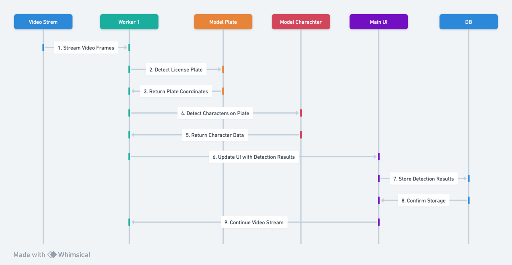
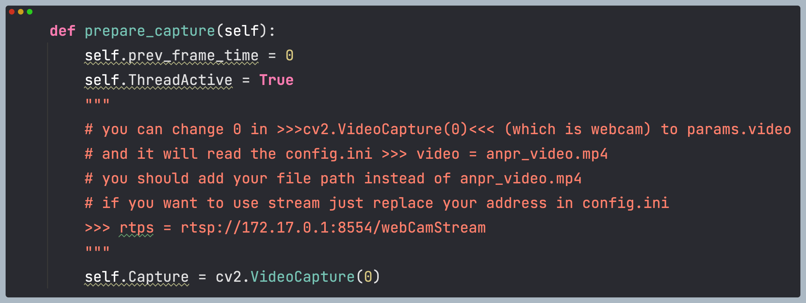

# 🚗 Colombian License Plate Recognition System (CLPR)

The Colombian License Plate Recognition (PLPR) system is a state-of-the-art solution designed for detecting and recognizing Colombian license plates in images and video streams. Leveraging advanced deep learning models and a user-friendly interface, it ensures reliable performance across different scenarios.

## 🔍 Overview

This system aims to tackle the unique challenges associated with Colombian license plate detection and recognition, offering high accuracy and efficiency. It's well-suited for applications in traffic monitoring, automated vehicle identification, and similar fields.

## ✨ Key Features

- **Advanced Detection**: Utilizes YOLOv8 models for high-accuracy license plate detection.
- **Colombian Character Recognition**: Custom-trained models ensure precise recognition of Colombian characters.
- **Real-Time Processing**: Capable of processing live video feeds in real-time.
- **User-Friendly GUI**: Intuitive graphical user interface simplifies interactions with the system.

## 🛠 Project Structure
The project is organized into clear and well-defined directories for easy understanding and use:

├── LICENSE                     # Project License (GPLv3)
├── config.ini                  # Main system configuration
├── requirements.txt             # Project Dependencies
├── ai/                         # AI Models and Scripts
├── base/                       # Base data(CSVs)
├── database/                   # Scripts and utilities for the database
├── gui/                        # .ui files for the graphical interface
├── helper/                     # Auxiliary functions
├── icons/                      # Icons used in the GUI
├── model/                      # Trained models (.pt)
├── services/                   # External services and utilities
├── streamlit_app.py            # Streamlit app for demos
└── yolov8/                     # YOLOv8 Implementation


---
## table of Contents
- [Main GUI Explanation](#main-gui-explanation)
- [System Hardware Requirements](#-system-hardware-requirements)
- [Installation](#-installation)
- [Use](#use)
- [Video Source Configuration](#-video-source-configuration)
- [Usage](#️-usage)
- [Additional Academic Resources](#-additional-academic-resources)
- [Special Thanks](#-special-thanks)
- [Repositories Used](#-repositories-used)
- [Use Cases](#-use-cases)
- [License](#-license)
- [Contact](#-contact)

<table>
<tr>
<td valign="top" width="50%">


   
   


</td>
<td valign="top" width="50%">

   ## Main GUI Explanation

- **1 Input View**: Shows video or camera feed.
- **2 Detected Plate Highlight**: Draws rectangle around detected plates.
- **3 Plate Image Display**: Shows captured image of the detected plate.
- **4 Extracted Text**: Displays text recognized from the plate image.
- **5 Owner Name**: Lists the registered owner's name.
- **6 Plate Status**: Indicates if the plate is allowed, not allowed, or non-registered.
- **7 Recent Entries Table**: Shows last 10 entries with options to add non-registered plates or view owner info.


</td>
</tr>
</table>


<table>
<tr>
<td valign="top" width="50%">

   ## Resident Management

   

Focuses on maintaining and updating resident vehicle information, managing permissions for entry, and tracking resident vehicle movements within the premises.

</td>
<td valign="top" width="50%">

   ## Entrance Management

   

Handles the regulation of vehicles entering and exiting the premises, ensuring only authorized vehicles gain access, and maintaining a log of all vehicle movements for security and administrative purposes.

</td>
</tr>
</table>


---
<table>
<tr>
<td valign="top" width="50%">



</td>
<td valign="top" width="50%">

   ## Main Flowchart Explanation

- **Start**: System initialization.
- **Input Feed**: Receives image/video stream.
- **Detect Plate**: YOLOv8 identifies license plates.
- **Character Recognition**: Custom model recognizes Colombian characters.
- **Database Check**: Compares plate with database for status and owner.
- **Display Results**: Shows detection and recognition results in GUI.
- **Log Entry**: Updates recent entries table and database.
- **End/Repeat**: Continues with new input or concludes operation.

</td>
</tr>
<tr>
<td colspan="2" valign="top">

**[Read the detailed flow in wiki](https://github.com/mtkarimi/smart-resident-guard/wiki/Main-Flow)**

</td>
</tr>
</table>

### 💻 System Hardware Requirements

- **Python 3.7+**  
- Key Libraries:  
  - [OpenCV](https://opencv.org/) for image manipulation.  
  - [NumPy](https://numpy.org/) for numerical calculation.  
  - [TensorFlow](https://www.tensorflow.org/) or [PyTorch](https://pytorch.org/) (depending on your choice of framework) for the recognition model.  

Please check the `requirements.txt` (or equivalent) file for more details.

## 🚀 Getting Started

### 🔧 Installation

1. **Clone the repository**:
   ```bash
   git clone https://github.com/oaacUis/tesis-colombian-plate-recognition.git
   ```
2. **Enter the project folder**:
   ```bash
   cd tesis-colombian-plate-recognition
   ```
3. **Virtual environment (recommended)**:
   ```bash
   python -m venv venv
   venv\Scripts\activate  # Windows
   ```
3. **Install dependencies**:
   ```bash
   pip install -r requirements.txt
   ```


## Use
1. **To start the main application with the graphical interface**:
   ```bash
   python home-yolo.py
   ```
2. **To test the interactive Streamlit application**:
   ```bash
   streamlit run streamlit_app.py
   ```

### 🔄 Video Source Configuration




To customize the video source for processing, modify the parameter in `cv2.VideoCapture(0)`, where `0` denotes the default webcam input. For using a specific video file, change this parameter to `params.video`, which fetches the video path from `config.ini`. In `config.ini`, set the `video` parameter to your video file path, e.g., `video = proy1.mp4`, replacing `proy1.mp4` with the path to your video file.

For streaming video sources, update the `config.ini` file with the stream address. Replace the existing video path with your stream address, for example, `rtps = rtsp://172.17.0.1:8554/webCamStream`. This adjustment allows the system to process video streams in real-time.

This flexibility in video source selection enables seamless integration and testing across various input methods, ensuring adaptability to different operational requirements.


## 🛠️ Usage

The system's GUI enables users to upload and process images or video streams, displaying detected license plates and recognized text. It also allows for parameter adjustments to optimize performance.

## 📚 Additional Academic Resources

Explore the `pdf-research` directory for research papers and articles on LPR technologies, offering insights into the techniques and algorithms behind the system.

## 💙 Special Thanks

Heartfelt thanks to the open-source projects and communities that have made this project possible. Special mentions include:

- **Matthew Truth (truthofmatthew)** who was the person who made the base of this project and served as inspiration for it.
- **YOLOv8** and **PyTorch** for the core detection and recognition models.
- **PySide6** and **OpenCV** for the application interface and image processing capabilities.
- **Pillow** for enhanced image manipulation.

## 📦 Repositories Used

- persian-license-plate-recognition: [GitHub](https://github.com/truthofmatthew/persian-license-plate-recognition)
- YOLOv8: [GitHub](https://github.com/ultralytics/yolov8)
- PyTorch: [GitHub](https://github.com/pytorch/pytorch)
- PySide6: [GitHub](https://github.com/PySide/PySide6)
- OpenCV: [GitHub](https://github.com/opencv/opencv)
- Pillow: [GitHub](https://github.com/python-pillow/Pillow)

## 📊 Use Cases

1. Parking Management
Automate the registration of vehicles entering and leaving a parking lot, improving efficiency and reducing operating costs.

2. Security and Surveillance
Integrate the system into security cameras to monitor and record suspicious vehicles in real time.

3. Intelligent Transport
Implement the system in public transport applications to improve fleet management and road safety.


## 📄 License

GPL-3.0. See the [LICENSE](LICENSE) file for details. It means you can:
- Share Source Code: If you distribute binaries or modified versions, you must make the source code available under GPL-3.
- License: Must keep and apply GPL-3 to the modified work.
- State Modifications: If modified, must disclose that it was changed.
  
---

## 📧 Contact
If you have questions, suggestions or want to report issues, you can contact the developers:

- Brayan Fonseca: 
   ✉️ BrayamFonck: [GitHub](https://github.com/BrayamFonck)
   💼 Brayan Fonseca: [LinkedIn](https://www.linkedin.com/in/brayan-steven-fonseca-gonzalez/)

- Otto Andrade: 
   ✉️ oaacUis: [GitHub](https://github.com/oaacUis)
   💼 Otto Andrade: [LinkedIn](https://www.linkedin.com/in/otto-andrade/)


¡Thank you for visiting this repository! 🚀
We hope that this project is useful for you and that you can get the most out of it. Don't forget to give it a try! ⭐ if you liked it! 😊

¡Con ❤️ desde Colombia para el mundo! 🇨🇴🚀

